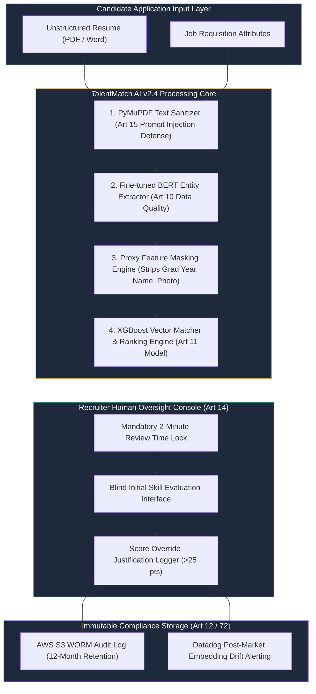
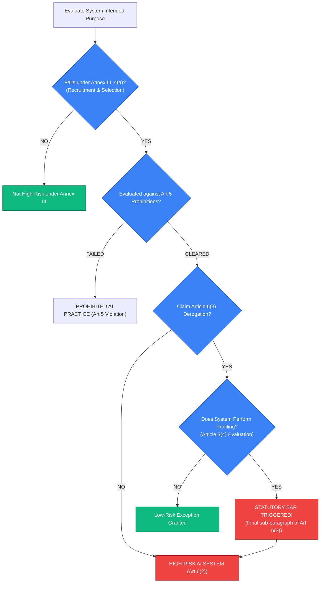
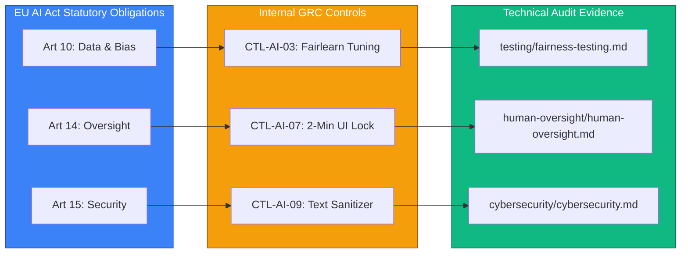

# Operational EU AI Act High-Risk Compliance Assessment (TalentMatch AI)

[_2024%2F1689-blue.svg)](https://eur-lex.europa.eu/legal-content/EN/TXT/?uri=CELEX:32024R1689)
[-red.svg)](classification/classification-analysis.md)
[](decision/go-no-go.md)
[](testing/fairness-testing.md)

---

> ### 🚨 PORTFOLIO DISCLAIMER
> This repository contains a **simulated EU AI Act High-Risk Compliance Assessment** created for **TalentMatch AI B.V.** It demonstrates practical AI governance engineering, statutory classification, Fairlearn bias testing, human oversight UI design, and regulator challenge readiness under **Regulation (EU) 2024/1689**. **It does not represent a real commercial entity, live regulatory filing, or official certification by an EU Market Surveillance Authority.**

---

## 📌 Executive Summary & Case Study Overview

**TalentMatch AI B.V.** (Amsterdam, Netherlands) develops **TalentMatch AI v2.4**—a B2B SaaS candidate screening and ranking engine used by 150+ enterprise HR departments across the European Union to process over 2.5 million job applicant resumes annually.

This project operationalizes the requirements of **Regulation (EU) 2024/1689 (EU AI Act)**, translating high-level legal articles into technical MLOps pipelines, empirical bias mitigations, structural UI friction controls, and an audit-ready compliance package.

```
┌──────────────────────────────────────────────────────────────────────────────────────┐
│                    TALENTMATCH AI COMPLIANCE SCORECARD                               │
├──────────────────────────────────────────────────────────────────────────────────────┤
│                                                                                      │
│   SYSTEM NAME          TalentMatch AI Candidate Screening & Ranking Engine v2.4      │
│   PROVIDER             TalentMatch AI B.V. (Amsterdam, Netherlands)                  │
│   DEPLOYER BASE        150+ Enterprise HR Departments across EU Member States        │
│   CLASSIFICATION       HIGH-RISK AI SYSTEM (Article 6(2) & Annex III, Section 4(a))  │
│   ART. 6(3) EXCEPTION  REJECTED (Statutory bar: Candidate profiling performed)       │
│   ART. 5 PROhibitions  CLEARED (No emotion recognition or biometric categorization)  │
│   DECISION             GO WITH CONDITIONS (6 Mandatory Deployment Gates Required)    │
│                                                                                      │
└──────────────────────────────────────────────────────────────────────────────────────┘
```

---

## 🔑 Key Analytical & Technical Highlights

- **Statutory Bar Rejection of Article 6(3) Exemption ([`classification/classification-analysis.md`](file:///c:/Users/ASUS/Documents/03-eu-ai-act-high-risk-assessment/classification/classification-analysis.md)):** 
  The system is classified as High-Risk under Annex III 4(a) (Recruitment). Any attempt to claim an Article 6(3) derogation is **legally barred** because the system performs automated candidate profiling (Article 3(4)), triggering the mandatory statutory bar in the final sub-paragraph of Article 6(3).
- **Empirical Bias Audit & Mitigation ([`testing/fairness-testing.md`](file:///c:/Users/ASUS/Documents/03-eu-ai-act-high-risk-assessment/testing/fairness-testing.md)):**
  Pre-mitigation testing revealed severe indirect discrimination against female applicants (DIR = 0.742), older candidates 45+ (DIR = 0.679), and non-Western EU names (DIR = 0.649). Following Fairlearn demographic parity calibration and proxy feature masking, all subgroup DIR metrics improved to $\ge 0.823$ (passing the 0.80 legal threshold), accepting a slight, legally mandatory accuracy trade-off ($0.78 \rightarrow 0.765$).
- **Anti-Automation Bias Human Oversight ([`human-oversight/human-oversight.md`](file:///c:/Users/ASUS/Documents/03-eu-ai-act-high-risk-assessment/human-oversight/human-oversight.md)):**
  Operationalizes Article 14 by replacing performative 45-second recruiter reviews with structural UI friction: enforcing a mandatory 2-minute review lock, blurring AI scores until recruiters complete a blind initial skill evaluation, and requiring written rationale for score overrides $>25$ points.
- **CV Prompt Injection Cybersecurity Defense ([`cybersecurity/cybersecurity.md`](file:///c:/Users/ASUS/Documents/03-eu-ai-act-high-risk-assessment/cybersecurity/cybersecurity.md)):**
  Neutralizes white-font hidden text instructions in candidate PDF resumes using a multi-stage PyMuPDF text sanitizer pre-parser before NLP tokenization.

---

## 🏗️ Interactive System Architecture & Governance Flow

### 1. AI Pipeline & Governance Boundary


---

### 2. Legal Classification & Article 6(3) Decision Tree


---

### 3. End-to-End Compliance Traceability Flow


---

## 🏛️ EU AI Act Implementation Timeline

Anchored strictly in **Regulation (EU) 2024/1689**:

- **August 2024:** Entry into Force.
- **February 2025 (6 Months):** Prohibited AI Practices (Chapter I & II, Art. 5) applicable.
- **August 2025 (12 Months):** General Purpose AI / GPAI Rules (Chapter V) applicable.
- **August 2026 (24 Months):** High-Risk AI Systems under Annex III (Art. 6(2)) applicable.
- **August 2027 (36 Months):** High-Risk AI Systems under Annex I (Art. 6(1)) applicable.

---

## 📋 The 6 Mandatory Deployment Sign-Off Gates

Commercial release to EU enterprise clients is **FROZEN** until all 6 gates receive formal sign-off:

1. **Gate 1 (Bias Calibration):** Disparate Impact Ratio (DIR) $\ge 0.823$ across female, age 45+, and non-Western candidate subgroups.
2. **Gate 2 (Human Oversight UI):** 2-minute UI interaction time lock & blind initial scoring interface deployed in console.
3. **Gate 3 (Cybersecurity Hardening):** PyMuPDF text sanitizer pre-parser deployed to neutralize CV prompt injection payloads.
4. **Gate 4 (Technical Documentation):** Consolidated Annex IV technical documentation binder in QMS repository.
5. **Gate 5 (Deployer Binding Agreements):** EU AI Act Governance Addendums & FRIA Toolkits executed with all 150+ clients.
6. **Gate 6 (Candidate Appeal Mechanism):** Candidate Score Explanation & Re-evaluation Portal launched providing a 14-day human review window.

---

## 📁 Repository Structure & Document Index

This case study is organized into 15 audit-ready AI governance working papers:

```
03-eu-ai-act-high-risk-assessment/
├── README.md                           # Master Overview & Recruiter Dashboard
├── scenario/
│   └── company-profile.md              # Provider (TalentMatch AI B.V.) & Deployer Ecosystem
├── ai-system/
│   ├── system-description.md           # Architecture, NLP Pipeline, ML Models, & Inputs/Outputs
│   ├── intended-purpose.md            # Article 3(12) Intended Purpose & Prohibited Uses
│   └── roles.md                        # Article 16 Provider vs Article 26 Deployer Duties
├── classification/
│   └── classification-analysis.md      # Art 5 Prohibitions, Art 6(2) Annex III 4(a), & Art 6(3) Statutory Bar
├── risk/
│   ├── ai-risk-register.md             # AIR-001..AIR-010 Risk Register & 5x5 Matrix
│   └── risk-treatment-plan.md          # Article 9(4) Treatment Strategies & Board Sign-offs
├── data-governance/
│   └── data-governance.md              # Article 10 Data Quality, Splits, & Proxy Masking
├── human-oversight/
│   └── human-oversight.md              # Article 14 Oversight, 2-Min UI Lock, & Anti-Automation UI
├── model-governance/
│   └── model-governance.md             # Article 11 Technical Documentation, Annex IV, & Model Card
├── testing/
│   ├── performance-testing.md          # Article 15 Accuracy, Robustness, & Trade-Off Analysis
│   └── fairness-testing.md             # Disparate Impact Ratio (DIR) Audit & Fairlearn Tuning
├── cybersecurity/
│   └── cybersecurity.md               # Article 15 Cybersecurity & PyMuPDF Prompt Injection Sanitizer
├── compliance/
│   └── control-matrix.md               # EU AI Act Control Matrix & End-to-End Traceability
├── monitoring/
│   └── post-market-monitoring.md       # Article 72 Post-Market Monitoring & Drift Circuit Breaker
├── incident-management/
│   └── incident-reporting.md           # Article 73 Serious Incident Reporting & 15-Day Playbook
├── decision/
│   └── go-no-go.md                     # Executive GO WITH CONDITIONS Decision & 6 Sign-off Gates
├── audit/
│   └── regulator-questions.md          # 15 EU AI Act Regulator Challenge Scenarios (Strong vs Weak)
└── templates/
    └── ai-assessment-template.md       # Reusable EU AI Act High-Risk Assessment Template
```

---

## 💡 GRC Practitioner Reflection & Takeaways

1. **Defensibility Over Checklist Compliance:** GRC engineering requires grounding decisions in empirical data (Fairlearn DIR metrics) and explicit statutory interpretation (Article 6(3) statutory profiling bar).
2. **Eliminating Performative Oversight:** "Human-in-the-loop" is a legal illusion if recruiters spend 45 seconds per resume. True Article 14 compliance requires cognitive forcing functions (UI locks, blind evaluation).
3. **Accepting Hard Constraints:** Achieving regulatory compliance required accepting a 1.5% drop in model accuracy to protect fundamental rights against age and ethnic discrimination.

---

## 📄 License & Attribution

This case study is published under the **MIT License**. Created as part of the Advanced AI Governance & Regulatory Specialist Portfolio Series.
